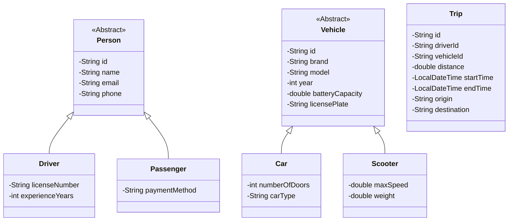

# Ecoride - Class Diagram

## Diagram Explanation

### Inheritance Hierarchy
- `Person` is an abstract base class that holds common attributes for all people in the system.
- `Driver` and `Passenger` inherit from `Person` and add their specific attributes.
- `Vehicle` is an abstract base class for all vehicle types.
- `Car` and `Scooter` inherit from `Vehicle` with their specific attributes.

### Associations
- The `Trip` class has associations with `Driver` and `Vehicle` through their IDs.
- This represents that a trip involves one driver and one vehicle.

### Key Attributes
- All entities have an `id` field for unique identification.
- Common attributes like name, email, and phone are in the base `Person` class.
- Vehicle-specific attributes are in their respective classes.
- The `Trip` class includes timing and location information for each journey.

To view this diagram, you can use any Mermaid-compatible viewer such as:
- VS Code with the Mermaid extension
- GitHub Markdown viewer
- Mermaid Live Editor (https://mermaid.live/)
